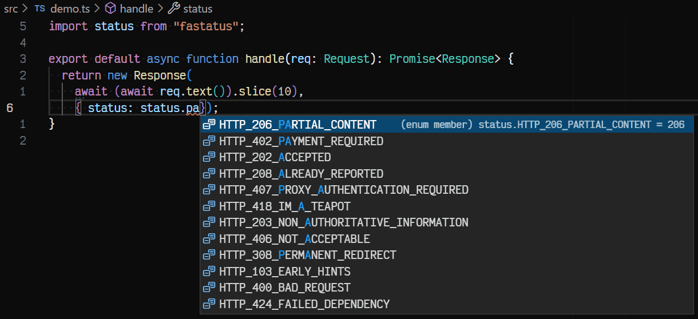

## What is `fastatus`?

`fastatus` (_FastAPI Status_) is an isomorphic helper library that provides an autocomplete friendly list of HTTP and Websocket status codes. It is modeled after the [`starlette.status`](https://github.com/encode/starlette/blob/25a52fe52a1fa4f55da4096fb0c7e6f6de0ae980/starlette/status.py) module from python used by [FastAPI](https://fastapi.tiangolo.com/).

My reason to release yet another http status code mapping package was for the specific names for the enumerated members. I wanted a package with both the number and the code name in the properties. This is the same _raison d'être_ for `starlette.status`, and it really helps when it comes to editor support:



## Installation

Install the [`fastatus` package](https://www.npmjs.com/package/fastatus) from npm using your favorite package manager.

```console
$ pnpm add fastatus
$ yarn add fastatus
$ npm install fastatus
```

## Usage

HTTP status codes are provided as an enum.

```typescript
import status from "fastatus";

console.log(status.HTTP_426_UPGRADE_REQUIRED);
// => 426

// Reverse mappings are available
console.log(status[508]);
// => 'HTTP_508_LOOP_DETECTED'
```

In addition to what's found in `starlette.status`, you can also get the IANA text description.

```typescript
import { description } from "fastatus";
console.log(description.HTTP_505_HTTP_VERSION_NOT_SUPPORTED);
// => "HTTP Version Not Supported"
```

## Status Codes

All assigned [http status codes](https://www.iana.org/assignments/http-status-codes/http-status-codes.xhtml#http-status-codes-1) and [websocket close codes](https://www.iana.org/assignments/websocket/websocket.xml#close-code-number) are included.
| Enum | Value | Description |
| ------------------------------------------ | --------- | ----------------------------------------------------------------------------------------------------- |
| `HTTP_100_CONTINUE` | 100 | Continue |
| `HTTP_101_SWITCHING_PROTOCOLS` | 101 | Switching Protocols |
| `HTTP_102_PROCESSING` | 102 | Processing |
| `HTTP_103_EARLY_HINTS` | 103 | Early Hints |
| | 104-199 | Unassigned |
| `HTTP_200_OK` | 200 | OK |
| `HTTP_201_CREATED` | 201 | Created |
| `HTTP_202_ACCEPTED` | 202 | Accepted |
| `HTTP_203_NON_AUTHORITATIVE_INFORMATION` | 203 | Non-Authoritative Information |
| `HTTP_204_NO_CONTENT` | 204 | No Content |
| `HTTP_205_RESET_CONTENT` | 205 | Reset Content |
| `HTTP_206_PARTIAL_CONTENT` | 206 | Partial Content |
| `HTTP_207_MULTI_STATUS` | 207 | Multi-Status |
| `HTTP_208_ALREADY_REPORTED` | 208 | Already Reported |
| | 209-225 | Unassigned |
| `HTTP_226_IM_USED` | 226 | IM Used |
| | 227-299 | Unassigned |
| `HTTP_300_MULTIPLE_CHOICES` | 300 | Multiple Choices |
| `HTTP_301_MOVED_PERMANENTLY` | 301 | Moved Permanently |
| `HTTP_302_FOUND` | 302 | Found |
| `HTTP_303_SEE_OTHER` | 303 | See Other |
| `HTTP_304_NOT_MODIFIED` | 304 | Not Modified |
| `HTTP_305_USE_PROXY` | 305 | Use Proxy |
| `HTTP_306_RESERVED` | 306 | (Unused) |
| `HTTP_307_TEMPORARY_REDIRECT` | 307 | Temporary Redirect |
| `HTTP_308_PERMANENT_REDIRECT` | 308 | Permanent Redirect |
| | 309-399 | Unassigned |
| `HTTP_400_BAD_REQUEST` | 400 | Bad Request |
| `HTTP_401_UNAUTHORIZED` | 401 | Unauthorized |
| `HTTP_402_PAYMENT_REQUIRED` | 402 | Payment Required |
| `HTTP_403_FORBIDDEN` | 403 | Forbidden |
| `HTTP_404_NOT_FOUND` | 404 | Not Found |
| `HTTP_405_METHOD_NOT_ALLOWED` | 405 | Method Not Allowed |
| `HTTP_406_NOT_ACCEPTABLE` | 406 | Not Acceptable |
| `HTTP_407_PROXY_AUTHENTICATION_REQUIRED` | 407 | Proxy Authentication Required |
| `HTTP_408_REQUEST_TIMEOUT` | 408 | Request Timeout |
| `HTTP_409_CONFLICT` | 409 | Conflict |
| `HTTP_410_GONE` | 410 | Gone |
| `HTTP_411_LENGTH_REQUIRED` | 411 | Length Required |
| `HTTP_412_PRECONDITION_FAILED` | 412 | Precondition Failed |
| `HTTP_413_REQUEST_ENTITY_TOO_LARGE` | 413 | Content Too Large |
| `HTTP_414_REQUEST_URI_TOO_LONG` | 414 | URI Too Long |
| `HTTP_415_UNSUPPORTED_MEDIA_TYPE` | 415 | Unsupported Media Type |
| `HTTP_416_REQUESTED_RANGE_NOT_SATISFIABLE` | 416 | Range Not Satisfiable |
| `HTTP_417_EXPECTATION_FAILED` | 417 | Expectation Failed |
| `HTTP_418_IM_A_TEAPOT` | 418 | (Unused) |
| | 419-420 | Unassigned |
| `HTTP_421_MISDIRECTED_REQUEST` | 421 | Misdirected Request |
| `HTTP_422_UNPROCESSABLE_ENTITY` | 422 | Unprocessable Content |
| `HTTP_423_LOCKED` | 423 | Locked |
| `HTTP_424_FAILED_DEPENDENCY` | 424 | Failed Dependency |
| `HTTP_425_TOO_EARLY` | 425 | Too Early |
| `HTTP_426_UPGRADE_REQUIRED` | 426 | Upgrade Required |
| | 427 | Unassigned |
| `HTTP_428_PRECONDITION_REQUIRED` | 428 | Precondition Required |
| `HTTP_429_TOO_MANY_REQUESTS` | 429 | Too Many Requests |
| | 430 | Unassigned |
| `HTTP_431_REQUEST_HEADER_FIELDS_TOO_LARGE` | 431 | Request Header Fields Too Large |
| | 432-450 | Unassigned |
| `HTTP_451_UNAVAILABLE_FOR_LEGAL_REASONS` | 451 | Unavailable For Legal Reasons |
| | 452-499 | Unassigned |
| `HTTP_500_INTERNAL_SERVER_ERROR` | 500 | Internal Server Error |
| `HTTP_501_NOT_IMPLEMENTED` | 501 | Not Implemented |
| `HTTP_502_BAD_GATEWAY` | 502 | Bad Gateway |
| `HTTP_503_SERVICE_UNAVAILABLE` | 503 | Service Unavailable |
| `HTTP_504_GATEWAY_TIMEOUT` | 504 | Gateway Timeout |
| `HTTP_505_HTTP_VERSION_NOT_SUPPORTED` | 505 | HTTP Version Not Supported |
| `HTTP_506_VARIANT_ALSO_NEGOTIATES` | 506 | Variant Also Negotiates |
| `HTTP_507_INSUFFICIENT_STORAGE` | 507 | Insufficient Storage |
| `HTTP_508_LOOP_DETECTED` | 508 | Loop Detected |
| | 509 | Unassigned |
| `HTTP_510_NOT_EXTENDED` | 510 | Not Extended (OBSOLETED) |
| `HTTP_511_NETWORK_AUTHENTICATION_REQUIRED` | 511 | Network Authentication Required |
| | 512-599 | Unassigned |
| `WS_1000_NORMAL_CLOSURE` | 1000 | Normal Closure |
| `WS_1001_GOING_AWAY` | 1001 | Going Away |
| `WS_1002_PROTOCOL_ERROR` | 1002 | Protocol error |
| `WS_1003_UNSUPPORTED_DATA` | 1003 | Unsupported Data |
| | 1004 | Reserved |
| `WS_1005_NO_STATUS_RCVD` | 1005 | No Status Rcvd |
| `WS_1006_ABNORMAL_CLOSURE` | 1006 | Abnormal Closure |
| `WS_1007_INVALID_FRAME_PAYLOAD_DATA` | 1007 | Invalid frame payload data |
| `WS_1008_POLICY_VIOLATION` | 1008 | Policy Violation |
| `WS_1009_MESSAGE_TOO_BIG` | 1009 | Message Too Big |
| `WS_1010_MANDATORY_EXT` | 1010 | Mandatory Ext. |
| `WS_1011_INTERNAL_ERROR` | 1011 | Internal Error |
| `WS_1012_SERVICE_RESTART` | 1012 | Service Restart |
| `WS_1013_TRY_AGAIN_LATER` | 1013 | Try Again Later |
| `WS_1014_BAD_GATEWAY` | 1014 | The server was acting as a gateway or proxy and received an invalid response from the upstream server |
| `WS_1015_TLS_HANDSHAKE` | 1015 | TLS handshake |
| | 1016-2999 | Unassigned |
| | 3000 | Unauthorized |
| | 3001-3999 | Unassigned |
| | 4000-4999 | Reserved for Private Use |

## Acknowledgements

- Forked from [rmuchall/http-status-ts](https://github.com/rmuchall/http-status-ts)
- [encode/starlette](https://github.com/encode/starlette/) for the great naming convention
